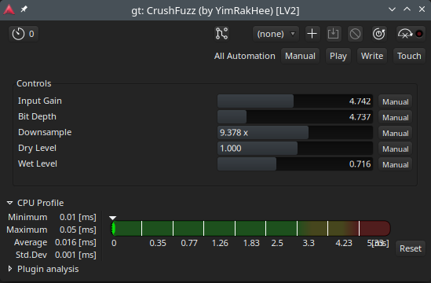

## CrushFuzz

Bitcrusher & Fuzz LV2 plugin for Guitar. Destructive digital artifacts with an Analog-style parallel mixing architecture.<br><br>
No GUI.<br>
Tested Environment: Arch Linux / Ardour.<br>



### Features
- **Digital Distortion:** Combines Bit depth reduction and Sample rate reduction (Downsampling) for sonic textures.

- **Parallel Processing Architecture:** Features independent Dry and Wet level controls. This allows you to blend the destroyed signal with the clean input to maintain low-end punch and transient clarity.

### Parameters
- **Input Gain:** Pre-processing amplification.
- **Bit Depth:** Amplitude quantization. Lower values introduce digital noise and lo-fi textures.
- **Downsample:** Sample rate reduction factor. Higher values result in "aliased" and synth-like tones.
- **Dry Level:** Level of the original clean signal.
- **Wet Level:** Level of the processed signal.

### Requirements
- LV2 SDK
- C++20 compatible compiler (GCC/Clang)
- CMake

### Build & Install (LINUX)
```bash
# Clone the repository
git clone https://github.com/YimRakHee/CrushFuzz.git
cd CrushFuzz

# Create a build directory
mkdir build && cd build

# Configure CMake and compile
cmake ..
make

# Install the plugin (installs to ~/.lv2/ by default)
make install
```

